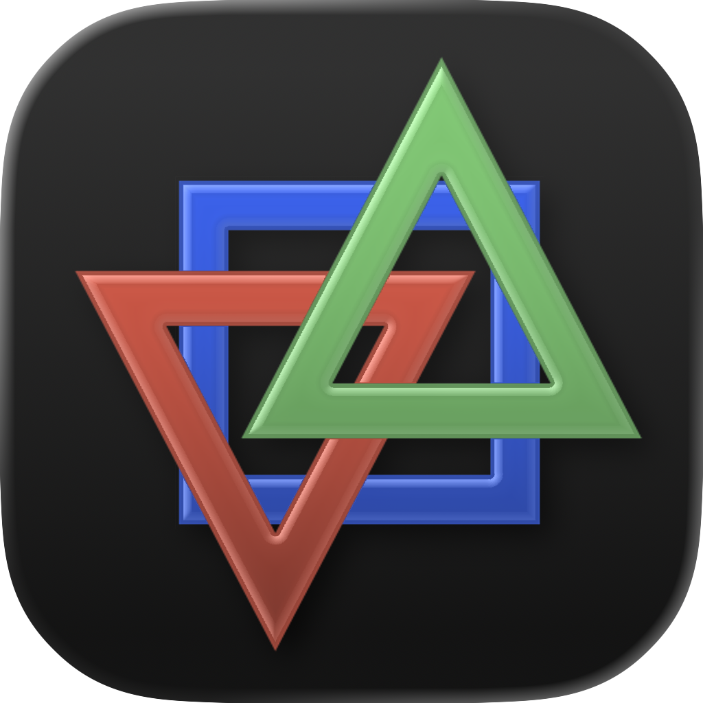
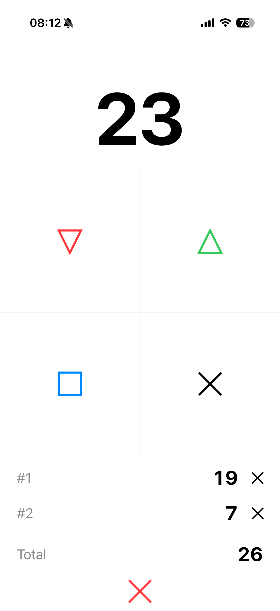
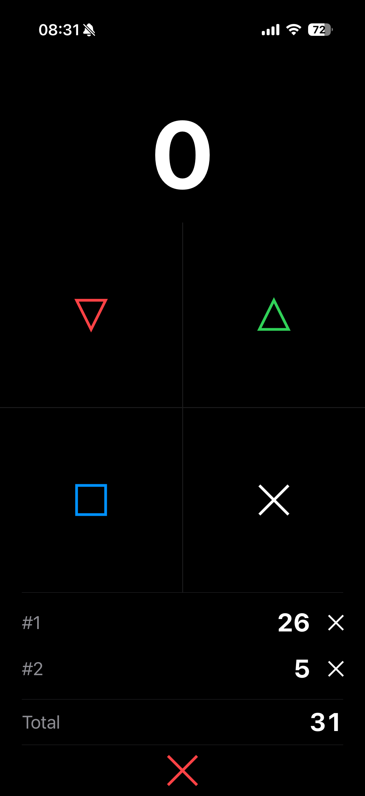
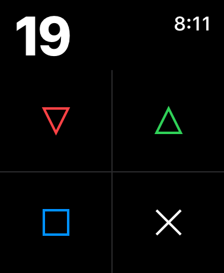

# Simply Count

A simple, elegant counter app for **iPhone, iPad, and Apple Watch** — built with SwiftUI.

<p align="center">
  
</p>

## Screenshots

<div align="center">
  
  &nbsp;&nbsp;&nbsp;
  
  &nbsp;&nbsp;&nbsp;
  
</div>

## Features

- **Increment / Decrement** — Tap the **△** (green, up) and **▽** (red, down) triangles to adjust the count. Includes haptic feedback.
- **Save** — Tap the **□** (blue) to save the current count to the list below and reset the counter to `0`.
- **Reset** — Tap the **✕** to reset the counter to `0` without saving.
- **Saved Counts History** — Each saved count appears in a scrollable list with an individual **✕** to remove it.
- **Total** — A running sum of all saved counts, displayed below the list.
- **Clear All** — A red **✕** at the bottom clears the entire saved list.
- **Haptic Feedback** — Light haptics on increment/decrement; stronger haptics on save/reset.
- **Light & Dark Mode** — Follows the system appearance automatically.

## Requirements

- Xcode 26.4.1+
- iOS 17.0+
- watchOS 11.0+
- Swift 6.0

## Project Structure

```
Simply Count/
├── project.yml                    # XcodeGen project specification
├── README.md
├── JustCount/                     # iOS (iPhone/iPad) app
│   ├── JustCountApp.swift         # App entry point
│   ├── ContentView.swift          # Main UI (2×2 grid + saved list)
│   ├── Info.plist
│   └── Assets.xcassets/
├── JustCount Watch App/           # watchOS app
│   ├── JustCountWatchApp.swift    # App entry point
│   ├── ContentView.swift          # Main UI (watch-optimized)
│   ├── Info.plist
│   └── Assets.xcassets/
└── Shared/                        # Shared between both targets
    ├── CounterViewModel.swift     # Observable view model
    └── iconjustcount.icon/        # Custom app icon
        ├── icon.json
        └── Assets/
```

## Architecture

### Shared ViewModel (`Shared/CounterViewModel.swift`)

Uses Swift's `@Observable` macro for reactive state management.

| Method | Description |
|---|---|
| `increment()` | Increases count by 1 |
| `decrement()` | Decreases count by 1 (minimum 0) |
| `reset()` | Sets count to 0 |
| `saveCurrentCount()` | Appends count to saved list, then resets to 0 |
| `removeSavedCount(at:)` | Removes a single saved count by index |
| `clearAllSavedCounts()` | Clears the entire saved list |

### Custom Shapes

Both apps share the same custom `Shape` implementations defined in each `ContentView.swift`:

- **`Triangle`** — A filled triangle pointing down (rotated 180° for the up arrow).
- **`Xmark`** — A diagonal cross (✕) drawn with two lines.

### UI — iOS (`JustCount/ContentView.swift`)

- Large count display centered at the top.
- **2×2 grid** occupying about half the screen height:
  - Row 1: **▽** (decrement) / **△** (increment)
  - Row 2: **□** (save) / **✕** (reset)
- Below the fold: saved counts list, total, and clear-all button.
- Scrollable when saved list grows.
- Stronger haptic feedback on save/reset buttons.

### UI — watchOS (`JustCount Watch App/ContentView.swift`)

- Count aligned to the leading edge with a compact font.
- Same 2×2 grid layout, scaled for the smaller screen.
- Saved counts appear below with matching total and clear-all.
- All buttons use standard haptic feedback.

## Generating the Xcode Project

The project uses [XcodeGen](https://github.com/XcodeGen/XcodeGen) to generate the `.xcodeproj` from `project.yml`.

```bash
xcodegen generate
```

## Building

Open the generated `Simply Count.xcodeproj` in Xcode and select the desired target:

- **Simply Count** — iOS (iPhone / iPad)
- **Simply Count Watch App** — Apple Watch (requires a paired iPhone for installation)

## App Icon

The app icon is defined using a `.icon` bundle at `Shared/iconjustcount.icon/`. To update it, place a 1024×1024 PNG named `iconjustcount.png` in `Shared/iconjustcount.icon/Assets/` and regenerate the project.
